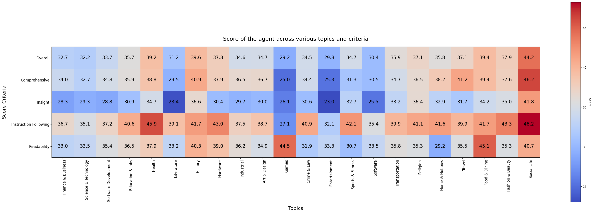

# Static-DRA: A Hierarchical Tree-based approach for creating Configurable and Static Deep Research Agent

A configurable and hierarchical tree-based static Deep Research Agent designed to overcome the limitations of standard RAG pipelines for complex, multi-turn research tasks.


## Overview

The **Static Deep Research Agent (Static-DRA)** introduces a novel approach to autonomous research by utilizing a static workflow governed by two user-tunable parameters: Depth and Breadth. Unlike dynamic workflows that can spiral in cost and complexity, Static-DRA allows users to explicitly balance the desired quality/comprehensiveness of the research against the computational cost (LLM tokens).

This architecture employs a hierarchical team of agents—Supervisor, Independent, and Worker—to facilitate multi-hop information retrieval and parallel sub-topic investigation.

## Architecture
The system operates on a hierarchical tree structure where a primary research topic is decomposed into sub-topics based on the configured parameters.

### Agent Roles

1. **Supervisor Agent**: Determines if a research topic can/should be split further. It consults the LLM to decide if the current node requires decomposition or direct research.

2. **Independent Agent**: Acts as a middle-manager. If a topic is split, it spawns child Supervisor agents for every sub-topic and aggregates their results.

3. **Worker Agent**: The leaf node of the tree. It performs the actual deep research using:

    - **LLM (Reasoning)**: Currently evaluated with gemini-2.5-pro.

    - **Web Search Tool**: Uses Tavily API to fetch relevant citations (filtering for relevance scores > 30%).

## The Tree Logic

The expansion of the research tree is controlled by the Depth (d) and Breadth (b) parameters.

  - **Depth**: How many levels deep the agent recursively breaks down topics.

  - **Breadth**: The maximum number of sub-topics spawned from a single parent topic.

Below are the evaluation metrics for Static-DRA at multiple configurations.


Note: The effective breadth decreases by a factor of 2 at each deeper level to focus resources on the most relevant core topics.

## Evaluation & Benchmarks

We evaluated Static-DRA against the DeepResearch Bench using the RACE (Reference-based Adaptive Criteria-driven Evaluation) framework.

**Configuration**:

  - Model: `gemini-2.5-pro`
  - Depth: `2`
  - Breadth: `5`

### Comparison vs State of the Art

|Metric|Overall Score|Comprehensiveness|Insight|Instruction Following|Readability|
|---|---|---|---|---|---|
|Gemini 2.5 Pro DeepResearch|49.71|49.51|49.45|50.12|50|
|OpenAI Deep Research|46.45|46.46|43.73|49.39|47.22|
|Claude Research|45.00|45.34|42.79|47.58|44.66|
|Static-DRA (Ours)|34.72|35.12|30.45|38.86|35.44|
|Gemini 2.5 Pro-preview-05-06|31.9|31.75|24.61|40.24|32.76|
|GPT-4o Search Preview|30.74|27.81|20.44|41.01|37.6|
|Sonar|30.64|27.14|21.62|40.7|37.46|

### Results

|Metric|Score 
|---|---|
|Overall|34.72|
|Comprehensiveness|35.12|
|Insight|30.45|
|Instruction Following|38.86|
|Readability|35.44|

### Citation

If you refer or use Static Deep Research Agent (Static-DRA) in your research, please cite my paper:

```
@misc{prateek2025hierarchicaltreebasedapproachcreating,
      title={A Hierarchical Tree-based approach for creating Configurable and Static Deep Research Agent (Static-DRA)}, 
      author={Saurav Prateek},
      year={2025},
      eprint={2512.03887},
      archivePrefix={arXiv},
      primaryClass={cs.AI},
      url={https://arxiv.org/abs/2512.03887}, 
}
```

